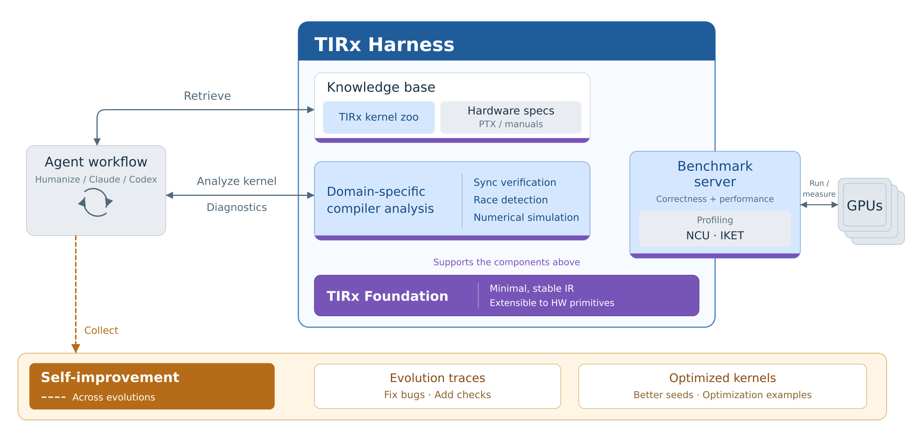

<div align="center" id="top">

# TIRx Harness

[](https://tirxharness.mlc.ai/docs/)
[](https://mlc.ai/agentic-gpu-programming-for-mlsys/)
[](https://github.com/mlc-ai/tirx-kernels)

**An Open Compiler Harness for Agentic GPU Programming**

[Get Started](#get-started) | [Documentation](https://tirxharness.mlc.ai/docs/) | [Book](https://mlc.ai/agentic-gpu-programming-for-mlsys/) | [Blogpost](https://blog.mlc.ai/2026/09/29/tirx-harness-an-open-compiler-harness-for-agentic-gpu-programming)

</div>

## Overview

TIRx Harness is a compiler harness combining a minimal stable compiler
foundation, a knowledge base, tools, and a benchmark server to help agents
develop correct, fast GPU kernels.

<p align="center">
  
</p>

TIRx Harness brings together:
* **TIRx-lite** for kernel authoring: a domain-specific language over the TIRx
  intermediate representation.
* **Compiler analysis**: check synchronization, memory races, and numerical
  behavior; inspect compiler output and generated GPU instructions.
* **[kcoral](https://kcoral.mlc.ai/)** for remote execution: keep your agent on
  one machine and run GPU work on another.

Skills guide the agent in using them, while workload contracts define
correctness and performance.

## Get Started

Install the released package from PyPI:

```bash
python -m pip install tirx-harness
```

To develop the harness, follow
[Build from source](https://tirxharness.mlc.ai/docs/installation.html#build-from-source)
for the build prerequisites, repository checkout, and native submodule setup.

See the [documentation](https://tirxharness.mlc.ai/docs/) for details:

- [Installation](https://tirxharness.mlc.ai/docs/installation.html): prerequisites, other installation methods, and agent skills
- [Quick Start](https://tirxharness.mlc.ai/docs/quick-start.html): optimize a kernel in your own project
- [Optimization Runs](https://tirxharness.mlc.ai/docs/optimization-runs.html): run a registered workload

The book [Agentic GPU Programming for MLSys](https://mlc.ai/agentic-gpu-programming-for-mlsys/)
explains the design behind the harness and walks through an optimization workflow.

## Contributing

- [Add a workload](https://tirxharness.mlc.ai/docs/development/add-workload.html): define a new optimization task
- [Contribute a kernel](https://tirxharness.mlc.ai/docs/development/contribute-kernel.html): publish a kernel produced by a run
- [Report and fix bugs](https://tirxharness.mlc.ai/docs/development/report-and-fix-bugs.html): reproduce and resolve a defect
